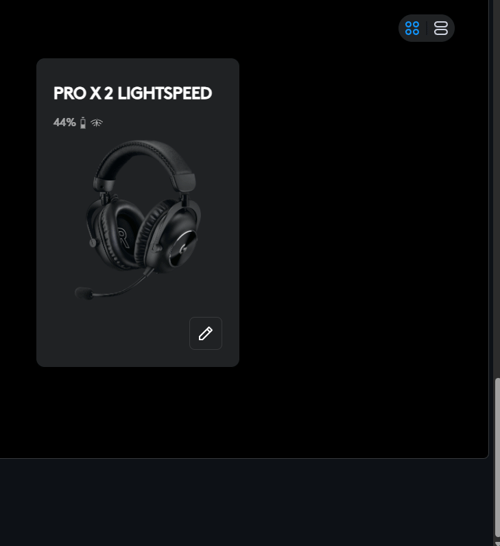

# PRO X 2 LIGHTSPEED AutoSwitch

[](https://github.com/Ayerdi/PROX2-AutoSwitch/actions/workflows/validate.yml)
[](LICENSE)
[](https://github.com/Ayerdi/PROX2-AutoSwitch/actions/workflows/pages.yml)

Automatically switch your Windows default audio output when you put on or take off your wireless headset.

- **Headset connected / powered on** → Windows uses the headset output.
- **Headset disconnected / powered off** → Windows falls back to your alternative output (e.g. PC speakers).
- Works with **any wireless headset whose connection state is exposed by Windows** (e.g. Jabra Evolve 65, which reports `Active` ↔ `Unplugged`), with a **device-specific fallback** for Logitech PRO X 2 (via Logitech G HUB) whose endpoint stays `Active` while off.
- Tray icon: enable/disable AutoSwitch and **disable/enable Windows audio enhancements** for the configured headset.
- Runs in the background with **no PowerShell window at login**.



See it live on the [project page](https://ayerdi.github.io/PROX2-AutoSwitch/).

## Why this exists

Wireless headsets keep their USB/LIGHTSPEED endpoint visible to Windows even when the physical headset is turned off. So Windows doesn't know it should switch back to your speakers.

The manual dance got old fast:

1. Take off the headset.
2. Open the sound settings.
3. Change the default output.
4. Put the headset back on.
5. Repeat.

This project removes that friction: switch the output just by turning the headset on or off.

## How it works

Two detection modes, chosen automatically at install:

**WindowsEndpoint (universal).** While powered on, most wireless headsets (e.g. Jabra Evolve 65) expose an audio endpoint whose `State` is `Active`; powered off, it becomes `Unplugged` (or disappears). The runtime reads the endpoint `State` via `svcl.exe`:

```
Endpoint State Active    → Connected → headset
Endpoint State Unplugged → Disconnected → fallback
```

**LogitechGHub (fallback for PRO X 2).** Tested on 2026-08-07: while the PRO X 2 is powered on, Logitech G HUB's battery query returns a `payload`; when powered off, it doesn't. AutoSwitch uses that signal:

```
PRO X 2
   │
   ▼
Logitech G HUB
ws://localhost:9010
   │
   ├── GET /devices/list
   │      └── locate the PRO X 2 extendedDisplayName
   │
   └── GET /battery/<deviceId>/state
             │
             ├── payload present -> ON
             └── payload absent  -> OFF
                         │
                         ▼
             SoundVolumeCommandLine
                         │
             /SetDefault <Item ID> all
                         │
                         ▼
                      Windows
```

In both modes the rule is the same: an **unknown** state never switches the output (a single `svcl.exe` failure must not send you to the speakers), and disconnection requires **two consecutive** OFF readings before switching to the fallback.

## Requirements

- Windows 10/11 x64.
- For the universal (`WindowsEndpoint`) mode: no vendor software required.
- For Logitech PRO X 2 (`LogitechGHub` mode): Logitech G HUB installed, open, and recognizing the PRO X 2.
- Internet connection during install (downloads `svcl.exe` from NirSoft).
- PowerShell 5.1 or newer.

No admin rights should be required for normal operation. Only toggling **Audio Enhancements** asks for a one-time UAC elevation.

## Installation

**One click** (downloads the latest release ZIP and its SHA-256 checksum, verifies the ZIP before extracting, then runs the full installer):

```powershell
powershell.exe -ExecutionPolicy Bypass -Command "irm https://raw.githubusercontent.com/Ayerdi/PROX2-AutoSwitch/main/install.ps1 | iex"
```

Or manually:

1. Extract the whole ZIP to a normal folder. Don't run the installer from inside the ZIP.
2. Open PowerShell in that folder.
3. If Windows blocked the downloaded scripts:

```powershell
Get-ChildItem . -Filter *.ps1 | Unblock-File
```

4. Run:

```powershell
powershell.exe -ExecutionPolicy Bypass -File ".\Instalar-PROX2-AutoSwitch.ps1"
```

The installer will:

- download SoundVolumeCommandLine from NirSoft;
- verify its SHA-256 before running it;
- detect the headset automatically:
  - if G HUB reports a PRO X 2 → `LogitechGHub` mode;
  - otherwise list the Windows audio endpoints so you pick the **headset** and the **fallback**;
  - ask you to turn the headset OFF and press Enter — if Windows shows `Active → Unplugged`, it picks `WindowsEndpoint` mode automatically; if not, it tries G HUB (Logitech only); if nothing works, it aborts instead of installing something that can't work;
- capture the real **Item ID**s of the current Windows;
- actually test both switches;
- offer to disable the headset's **Audio Enhancements** (one UAC prompt);
- save the configuration;
- install the runtime;
- create an invisible autostart entry via `wscript.exe`;
- start AutoSwitch.

### Tray icon

Once running, an icon appears in the system tray:

- **AutoSwitch: Enabled / Disabled** — pause or resume switching without quitting.
- **Disable / Enable Audio Enhancements for <headset>** — toggles the global Windows audio enhancements of the configured headset endpoint (a UAC prompt appears; the menu updates only if the change is verified).
- **Exit** — stop AutoSwitch.

### Important

Windows audio `Item ID`s are **not reused** across installs. The installer is designed to capture them from your current Windows. Don't copy `config.json` from another machine.

The `dev000000XX` ID from G HUB isn't persisted either. The runtime keeps the `extendedDisplayName` and discovers the current `deviceId` at startup.

## Where it installs

```text
%LOCALAPPDATA%\PROX2AutoSwitch\
```

Main contents:

```text
PROX2AutoSwitch.ps1        # runtime (tray)
config.json
svcl.exe
Toggle-AudioEnhancements.ps1   # helper elevado (UAC) de enhancements
icon.ico
Iniciar-Oculto.vbs
autoswitch.log
Desinstalar-PROX2-AutoSwitch.ps1
Verificar-PROX2-AutoSwitch.ps1
lib\AutoSwitchCore.psm1    # lógica compartida
control\                   # flags de comunicación tray <-> worker
```

Autostart is created in the user's Startup folder as:

```text
PRO X 2 AutoSwitch.lnk
```

That shortcut runs `wscript.exe`, which starts PowerShell hidden — no console window at login.

## Verify it works

```powershell
powershell.exe -ExecutionPolicy Bypass -File ".\Verificar-PROX2-AutoSwitch.ps1"
```

Or use the installed copy:

```powershell
powershell.exe -ExecutionPolicy Bypass -File "$env:LOCALAPPDATA\PROX2AutoSwitch\Verificar-PROX2-AutoSwitch.ps1"
```

Manual test:

1. Power on / connect the headset.
2. Wait ~1–2 seconds.
3. Windows should select the headset.
4. Power off / disconnect it.
5. After two consecutive checks (~3 seconds), Windows should select the alternative output.

Two consecutive OFF readings are required before treating the headset as disconnected, to avoid flapping on a one-off reading.

## Log

```text
%LOCALAPPDATA%\PROX2AutoSwitch\autoswitch.log
```

Expected example:

```text
PRO X 2 AutoSwitch started (mode LogitechGHub).
Connected to G HUB.
PRO X 2 detected by G HUB: PRO X 2 Lightspeed Gaming Headset (dev...)
Output changed -> PRO X 2 LIGHTSPEED — Cascos Gaming
Output changed -> High Definition Audio Device — Altavoces AMAZON
```

## Uninstall

From the package:

```powershell
powershell.exe -ExecutionPolicy Bypass -File ".\Desinstalar-PROX2-AutoSwitch.ps1"
```

or from the installation:

```powershell
powershell.exe -ExecutionPolicy Bypass -File "$env:LOCALAPPDATA\PROX2AutoSwitch\Desinstalar-PROX2-AutoSwitch.ps1"
```

## Known bug — do NOT reintroduce

`svcl.exe /GetColumnValue` already writes the value to stdout. Do **not** use:

```powershell
svcl.exe /Stdout /GetColumnValue ...
```

In an earlier implementation `/Stdout` prepended item info (`1 item found:`, name, etc.) and corrupted the Item ID, so `/SetDefault` got an invalid identifier and answered `No items found`.

The correct form used in this version is:

```powershell
svcl.exe /GetColumnValue "DefaultRenderDevice" "Item ID"
```

then extract only:

```text
{0.0.0.00000000}.{GUID}
```

## Security notes

- The G HUB WebSocket `localhost:9010` is **not an officially supported Logitech API**. It's a reverse-engineered local interface used by third-party projects. Logitech can change it in future G HUB releases. If it stops working after a G HUB update, see `AGENT.md`.
- The installer downloads `svcl-x64.zip` from NirSoft and verifies its SHA-256. If NirSoft ships a new version the hash may change and the installer **fails safely**. Don't remove that check.

## Repository layout

- `install.ps1` — one-click bootstrap: fetches the latest release ZIP and its `.sha256`, verifies the hash, then runs the installer.
- `Instalar-PROX2-AutoSwitch.ps1` — clean install (universal + G HUB paths, auto detection mode). Skips the `svcl.exe` download if it is already installed.
- `Runtime-PROX2-AutoSwitch.ps1` — the runtime copied to `%LOCALAPPDATA%`: tray icon + invisible `Form` message pump, with the polling in a separate worker process (`AUTOSWITCH_WORKER=1`).
- `Toggle-AudioEnhancements.ps1` — elevated helper (UAC) that disables/enables the headset's Audio Enhancements.
- `Desinstalar-PROX2-AutoSwitch.ps1` — removes process, autostart and files (with truthful per-step reporting).
- `Verificar-PROX2-AutoSwitch.ps1` — quick diagnostics.
- `lib/AutoSwitchCore.psm1` — shared pure logic (Item ID extraction, CSV parse, endpoint state mapping, OFF debounce, config validation/migration, C# COM interop) used by installer, runtime and tests.
- `assets/icon.ico` — tray icon.
- `docs/` — design notes (the `WindowsEndpointProvider.md` is superseded; see CHANGELOG v1.2.0).
- `tests/` — Pester coverage for the pure logic (with a real `svcl /scomma` fixture).
- `site/` — the [GitHub Pages site](https://ayerdi.github.io/PROX2-AutoSwitch/), ES/EN.
- `AGENT.md` — context so an AI agent can maintain/rebuild the project.
- `SOURCES.md` — verified technical references.
- `SECURITY.md` — security scope and how to report a vulnerability.
- `CHANGELOG.md` — version history (Keep a Changelog).
- `.github/workflows/validate.yml` — CI: PowerShell syntax, PSScriptAnalyzer, Pester.
- `.github/workflows/pages.yml` — CI that deploys `site/` to GitHub Pages.
- `.github/workflows/release.yml` — builds the release ZIP + `.sha256` on `v*` tags.
