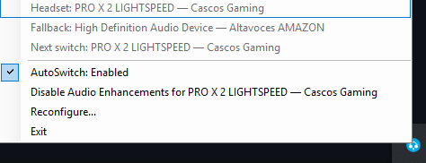

# Audio AutoSwitch

[](https://github.com/Ayerdi/PROX2-AutoSwitch/actions/workflows/validate.yml)
[](LICENSE)
[](https://github.com/Ayerdi/PROX2-AutoSwitch/releases/latest)
[](https://github.com/Ayerdi/PROX2-AutoSwitch/actions/workflows/pages.yml)

Automatically switch the Windows default audio output when a compatible wireless headset turns on or off.

**Stable release: v1.2.5 · Windows 10/11 x64**

- Headset on / connected → use the headset.
- Headset off / disconnected → return to the configured fallback output.
- Generic path for headsets whose Windows endpoint exposes connection state.
- Logitech PRO X 2 fallback through Logitech G HUB when Windows keeps the endpoint `Active` while the physical headset is off.
- Tray controls for AutoSwitch, reconfiguration and Windows Audio Enhancements.
- Invisible startup: no PowerShell window at login.


## Start here

- **Website:** https://ayerdi.github.io/PROX2-AutoSwitch/
- **Wiki:** https://github.com/Ayerdi/PROX2-AutoSwitch/wiki
- **Spanish Wiki:** https://github.com/Ayerdi/PROX2-AutoSwitch/wiki/Inicio
- **Technical docs:** [`docs/INDEX.md`](docs/INDEX.md)
- **Support:** [`SUPPORT.md`](SUPPORT.md)
- **Security:** [`SECURITY.md`](SECURITY.md)
- **Releases:** https://github.com/Ayerdi/PROX2-AutoSwitch/releases

The repository, code, Pages site and technical documentation are English-first. The Wiki is maintained in both English and Spanish.

## Quick start

### Recommended: release ZIP

1. Open the [latest release](https://github.com/Ayerdi/PROX2-AutoSwitch/releases/latest).
2. Download **`Audio-AutoSwitch.zip`**.
3. Extract it to a normal folder.
4. Double-click **`Install.cmd`**.
5. Select the headset and fallback output.
6. Follow the `ON → OFF → ON` validation wizard.

The same package includes:

- **`Verify.cmd`** — run diagnostics.
- **`Uninstall.cmd`** — remove AutoSwitch.

The `.cmd` files are intentionally tiny launchers. The reviewed PowerShell implementation remains visible in the package.

### One-command install

The bootstrap downloads the latest versioned release ZIP and checksum, verifies SHA-256, then starts the installer:

```powershell
powershell.exe -ExecutionPolicy Bypass -Command "irm https://raw.githubusercontent.com/Ayerdi/PROX2-AutoSwitch/main/install.ps1 | iex"
```

## How it works

The installer chooses one of two detection modes.

### WindowsEndpoint

This is the general mode. It works when Windows exposes a meaningful state transition for the headset endpoint.

```text
Active                      → Connected    → headset
Unplugged / NotPresent      → Disconnected → fallback
Unknown / invalid reading   → no switch
```

This path was validated with a Jabra Evolve 65. No vendor application is required when Windows exposes the physical connection state correctly.

Bluetooth/Core Audio can recreate an endpoint after reconnecting. The installer and **Reconfigure...** flow therefore tolerate real reconnect latency and can re-resolve the endpoint by its stable `Device Name` + `Name` identity before persisting the newest `Item ID`.

### LogitechGHub

The Logitech PRO X 2 is an important exception: its Windows endpoint can remain `Active` while the physical headset is off. For that device AutoSwitch uses G HUB's local WebSocket as the physical-state signal:

```text
PRO X 2
  ↓
Logitech G HUB · ws://localhost:9010
  ↓
GET /devices/list
GET /battery/<deviceId>/state
  ↓
payload present → ON
payload absent  → OFF
  ↓
Windows Core Audio / IPolicyConfig → all default roles
```

The G HUB interface is unofficial and may change in a future G HUB release. See [`SOURCES.md`](SOURCES.md) and [`AGENT.md`](AGENT.md) for the verified design notes.

### Safety rules

Two rules are deliberate:

1. An **unknown** state never changes the Windows output.
2. Disconnection needs **two consecutive OFF observations** before switching to the fallback.

A transient Core Audio or G HUB failure therefore cannot send audio to the wrong device on a single bad read.

## Requirements

- Windows 10/11 x64.
- PowerShell 5.1 or newer.
- No vendor software for compatible `WindowsEndpoint` headsets.
- Logitech G HUB installed and running for `LogitechGHub` mode.

Normal runtime operation does not require administrator rights. Toggling global Windows Audio Enhancements uses a one-time UAC elevation for the helper process only.

## Installer behavior

The installer:

- uses the Windows Core Audio APIs in-process, so no third-party audio-control executable is downloaded;
- lists current Windows render devices and lets you choose the headset and fallback;
- validates the real `ON → OFF → ON` cycle with bounded polling windows of 15 s / 15 s / 20 s;
- handles a Bluetooth endpoint that returns with a new `Item ID`;
- falls back to Logitech G HUB only when Windows cannot expose a useful physical state and the selected headset is confirmed as a PRO X 2;
- captures machine-local Item IDs;
- performs real test switches in both directions;
- optionally disables Audio Enhancements for the headset;
- installs the runtime under `%LOCALAPPDATA%`;
- creates invisible per-user startup;
- starts AutoSwitch.

If no supported detection method can be proven, installation stops instead of creating a configuration that cannot work.

## Tray and reconfiguration

The tray menu shows the configured headset, fallback and next switch action.



It also provides:

- **AutoSwitch: Enabled / Disabled** — pause or resume switching.
- **Disable / Enable Audio Enhancements** — change the configured headset's global Windows enhancement state, with UAC only for the helper.
- **Reconfigure...** — choose new endpoints and repeat the complete detection wizard without reinstalling.
- **Exit** — stop AutoSwitch.

A failed reconfiguration leaves the previous working configuration untouched.

## Machine-local identifiers

Windows audio `Item ID`s are machine-local and can change after driver changes or endpoint recreation. Do not copy `config.json` from another PC.

The G HUB `deviceId` is also not persisted because it may change. AutoSwitch keeps the stable display identity and resolves the current G HUB ID when needed.

## Verify and uninstall

From an extracted release:

```text
Verify.cmd
Uninstall.cmd
```

PowerShell equivalents:

```powershell
.\Verify-AutoSwitch.ps1
.\Uninstall-AutoSwitch.ps1
```

The package also retains the older Spanish-named `.ps1` entrypoints for backward compatibility with existing shortcuts and automation. New documentation uses the English aliases.

Installed runtime data lives under:

```text
%LOCALAPPDATA%\PROX2AutoSwitch\
```

The main log is:

```text
%LOCALAPPDATA%\PROX2AutoSwitch\autoswitch.log
```

## Native Windows audio backend

Endpoint enumeration, state reads and default-device verification now use Windows Core Audio directly in-process. The project keeps its existing PowerShell structure and embedded C# COM bridge; no separate audio-control executable is downloaded. Setting the default endpoint uses the same `IPolicyConfig` COM interop family already used by the project for Audio Enhancements, and every switch is verified across Console, Multimedia and Communications roles with one bounded retry.

## Security

- Audio endpoint enumeration and switching run in-process; installation no longer downloads a third-party audio-control binary.
- Release ZIPs publish SHA-256 checksums and are built reproducibly.
- The G HUB WebSocket is local but unofficial; treat compatibility changes after G HUB updates as expected maintenance risk.
- Normal runtime is non-elevated; only the Audio Enhancements helper requests UAC.
- Please report security issues through the process in [`SECURITY.md`](SECURITY.md), not a public issue.

## Repository layout

```text
Install.cmd / Verify.cmd / Uninstall.cmd   double-click entrypoints
Install-AutoSwitch.ps1                     canonical installer alias
Verify-AutoSwitch.ps1                      canonical verifier alias
Uninstall-AutoSwitch.ps1                   canonical uninstaller alias
Instalar-*.ps1 / Verificar-*.ps1 /         legacy compatible entrypoints
Desinstalar-*.ps1
Runtime-PROX2-AutoSwitch.ps1               tray UI + worker runtime
Toggle-AudioEnhancements.ps1               elevated enhancement helper
lib/AutoSwitchCore.psm1                    shared pure logic + COM interop
install.ps1                                checksum-verifying bootstrap
tests/                                     Pester regression coverage
docs/                                      technical and historical notes
wiki/                                      versioned English + Spanish Wiki source
site/                                      GitHub Pages source
scripts/                                   release and repository tooling
```

## Development

Before opening a pull request, run the relevant Pester suite and keep the repository checks green. See [`CONTRIBUTING.md`](CONTRIBUTING.md) and [`docs/INDEX.md`](docs/INDEX.md).

The project intentionally keeps hardware-specific findings and source references in [`AGENT.md`](AGENT.md) and [`SOURCES.md`](SOURCES.md) so future maintenance does not have to rediscover already-tested behavior.

## License

MIT. See [`LICENSE`](LICENSE).
